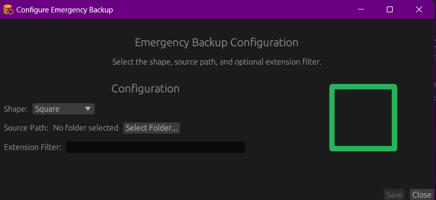
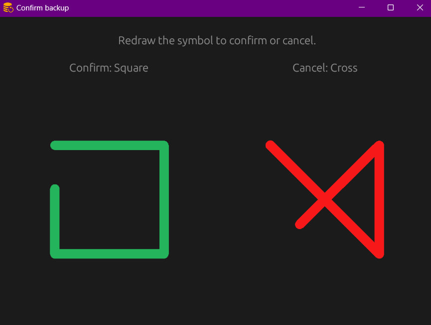
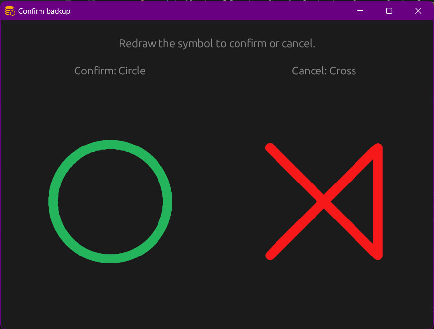

# Emergency Backup

Progetto per il corso “Programmazione di Sistema” (02GRSOV) della Laurea Magistrale in Ingegneria Informatica presso il Politecnico di Torino.

## Descrizione

Applicazione con lo scopo di effettuare un back-up nel caso in cui lo schermo non sia agibile. Qualora l’utente voglia effettuare un backup su un disco esterno (connesso via USB), dovrà utilizzare un comando convenzionale attraverso il mouse.

Dopo aver inviato il comando di attivazione di backup, l’utente deve dare conferma tracciando nuovamente il simbolo. La sorgente del back-up può essere indicata in fase di definizione del tool (che viene salvata in un file di configurazione). Dopo che il comando di attivazione del back-up è stato riconosciuto verrà visualizzata nello schermo una finestra di conferma.

Il programma prevede diverse tipologie di backup (ad esempio il contenuto di una cartella oppure solo i file di un determinato tipo).

L’applicazione viene automaticamente installata e viene eseguita in fase di bootstrap del PC rimanendo attiva in background.

L’applicazione deve avere il minor consumo di CPU possibile. Per valutare il consumo di CPU ogni 2 minuti viene salvato su un file di log il consumo di CPU effettuato dall’applicazione.

Al termine dell’esecuzione di backup, nella medesima chiavetta, viene creato un file di log che specifica la dimensione complessiva dei file salvati ed il tempo di CPU impiegato per il completamento delle operazioni di backup.

## Funzionalità

- **Configurazione**: è possibile associare a uno dei simboli supportati una certa cartella come sorgente del backup, e un opzionale filtro per l’estensione dei file da considerare. Soltanto i simboli configurati saranno rilevati dall’applicativo.
- **Rilevazione del simbolo**: il movimento del mouse è rilevato in polling, e viene usato l’algoritmo “[1$ Unistroke Recognizer](https://depts.washington.edu/acelab/proj/dollar/index.html)” per cercare una corrispondenza con i simboli noti.
- **Finestra di conferma**: dopo la rilevazione del simbolo viene aperta una finestra di conferma per mostrare all’utente i simboli di conferma o cancellazione del backup.
- **Suoni ausiliari**: l’utilizzo dell’applicazione è guidato tramite l’utilizzo di suoni, emessi al momento della rilevazione del simbolo, alla conferma e alla cancellazione del backup.
- **Backup**: il backup avviene dopo la conferma dell’utente, seguendo la configurazione associata al simbolo rilevato, e i file vengono salvati nel primo dispositivo di archiviazione USB rilevato.
- **Log del consumo**: l’applicazione monitora il proprio consumo di risorse all’interno del sistema, scrivendo in un file di log ogni 2 minuti il consumo di CPU medio.
- **Avvio automatico**: l’applicazione viene automaticamente installata in modo tale da avviarsi automaticamente al bootstrap del PC. Può inoltre essere disinstallata tramite un’opzione di avvio.

## Demo

La seguente schermata mostra la finestra di configurazione, avviata in automatico alla prima esecuzione o agli avvii successivi se richiesto dall’utente.



Le seguenti schermate mostrano la finestra di conferma del simbolo tracciato, con la quale l’utente è guidato visivamente per la scelta dell’azione da fare.





## Installazione

Dopo aver clonato il progetto, eseguire `cargo build` per compilarlo e scaricare automaticamente le dipendenze. Per eseguirlo, utilizzare `cargo run`.

> Per far funzionare l’applicativo su Linux potrebbero essere richieste alcune librerie aggiuntive da installare autonomamente. L’applicativo è stato testato su X11 e non è garantita la piena compatibilità con Wayland.


Nota: l’applicazione può ricevere alcune flag da linea di comando. Per elencarle, è sufficiente eseguire l’applicazione con la flag `--help` (e.g. `./EmergencyBackup --help` o `cargo run -- --help`). Oltre a `--help`, le opzioni attualmente supportate sono `--config` e `--uninstall`.

## Utilizzo

Alla prima apertura verrà avviata automaticamente una finestra di configurazione, che permette di associare a un determinato simbolo la sorgente del backup e un eventuale filtro per l’estensione dei file da considerare.

> **Nota**: nelle esecuzioni successive alla prima non verrà richiesto nuovamente di configurare l’applicativo; è possibile aprire la finestra di configurazione per creare nuove configurazioni o modificarne di esistenti come spiegato in seguito tramite l’opzione `--config`.
>

Dopo aver salvato la configurazione per almeno uno dei simboli disponibili, una volta chiusa la finestra, l’applicazione attenderà di rilevare una delle forme scelte effettuata tramite il movimento del mouse.

L’utente, nel momento del bisogno, traccerà con il mouse la forma desiderata. Verrà emesso un suono di conferma di rilevamento, dopo il quale l’utente può confermare la volontà di effettuare il backup ritracciando la stessa forma, oppure annullare il backup tracciando la forma di una “X”. In entrambi i casi verrà emesso un suono di conferma, così da guidare l’utente nell’utilizzo dell’applicazione.

Al termine del backup verrà emesso un suono di completamento e verrà salvato nella USB di destinazione un file di log contenente la quantità di bytes copiata e il tempo impiegato.

## Configurazione

Per configurare l’applicazione è possibile utilizzare una GUI, che viene aperta in automatico con l’opzione `--config`.

```bash
cargo run -- --config
```

## Test

Per eseguire i test dell’applicazione, utilizzare il seguente comando:

```bash
cargo test
```

Nota: alcuni test richiedono la presenza di una chiavetta USB connessa per completare con successo.